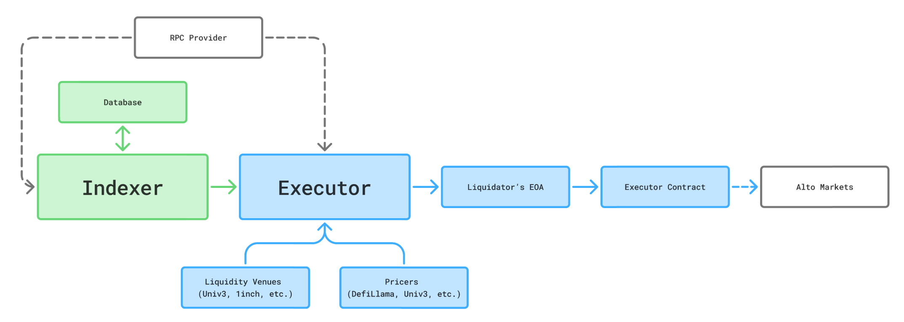

# Alto Liquidation Bot

A liquidation bot for [Alto](https://altofoundation.org) lending markets. Detects underwater positions and executes liquidations on-chain via a gated executor contract.

The system consists of two services:

- **Indexer** (`apps/indexer`) - [Ponder](https://ponder.sh)-based on-chain indexer that tracks markets, positions, USMs (Alto's peg-stability module), and oracle prices. Exposes an API consumed by the executor.
- **Executor** (`apps/executor`) - Bot that polls the indexer for liquidatable positions, plans optimal swap routes, and executes liquidations.

### Disclaimer

This bot is provided as-is, without any warranty. The authors are **not responsible** for any loss of funds resulting from the use of this bot, including gas fees, failed transactions, or liquidations on misconfigured markets. Use at your own risk.

## Requirements

- Node.js >= 18.14
- [pnpm](https://pnpm.io/)
- [Bun](https://bun.sh/) (used by the executor runtime)
- A reliable RPC endpoint (Alchemy, Infura, etc.)
- The private key of an EOA with ETH for gas
- An executor contract deployed for that EOA (see [Executor Deployment](#3-deploy-the-executor-contract))

For running fork tests, you also need [Foundry](https://book.getfoundry.sh/) (Anvil).

## Quick Start

```bash
git clone https://github.com/altomoney/liquidation-bot.git
cd liquidation-bot
pnpm install
```

### 1. Configure the Indexer

Copy the example env and fill in your values:

```bash
cp apps/indexer/.env.example apps/indexer/.env.local
```

| Variable                  | Required | Description                                                                                                 |
| ------------------------- | -------- | ----------------------------------------------------------------------------------------------------------- |
| `CHAIN_ID`                | Yes      | Chain ID (currently `1` for Ethereum Mainnet)                                                               |
| `PONDER_RPC_URL`          | Yes      | RPC URL for indexing on-chain data                                                                          |
| `MARKET_REGISTRY_ADDRESS` | Yes      | Alto market registry contract (`0xBd45d50611c38E35dD1D1119077De1E988eD2257` on mainnet)                     |
| `USM_REGISTRY_ADDRESS`    | Yes      | USM registry contract (`0xAD5620e10C33918E2C6A2E8E53325bf98c548E5e` on mainnet)                             |
| `DUSD_ADDRESS`            | Yes      | DUSD token address (`0x63d74d22E689C715a04F2C13962b1f77F443d35b` on mainnet)                                |
| `START_BLOCK`             | Yes      | Block to start indexing from (`23981920` on mainnet)                                                        |
| `POSTGRES_DATABASE_URL`   | No       | Postgres connection string. If omitted, uses embedded PGLite (good for dev, not recommended for production) |

### 2. Configure the Executor

Copy the example env and fill in your values:

```bash
cp apps/executor/.env.example apps/executor/.env.local
```

| Variable                    | Required | Description                                                         |
| --------------------------- | -------- | ------------------------------------------------------------------- |
| `RPC_URL_1`                 | Yes      | RPC URL for the executor (can be the same as the indexer's)         |
| `EXECUTOR_ADDRESS_1`        | Yes      | Your deployed executor contract address                             |
| `LIQUIDATION_PRIVATE_KEY_1` | Yes      | Private key of the EOA that owns the executor                       |
| `PONDER_SERVICE_URL`        | No       | Indexer API URL. Defaults to `http://localhost:42069`               |
| `FLASHBOTS_PRIVATE_KEY`     | No       | When set, transactions are sent via Flashbots                       |
| `SKIP_CHECK_FOR_PROFIT`     | No       | Set to `"true"` to liquidate regardless of profitability            |
| `DEBUG_LIQUIDATION`         | No       | Set to `"1"` to log `debug_traceCall` output for failed simulations |
| `ONE_INCH_SWAP_API_KEY`     | No\*     | API key for the 1inch liquidity venue                               |
| `ODOS_API_KEY`              | No\*     | API key for Odos (public endpoint works without it)                 |

All per-chain variables use the suffix `_<chainId>` (e.g. `_1` for mainnet).

> **\*** Setting at least one of `ONE_INCH_SWAP_API_KEY` or `ODOS_API_KEY` is highly recommended. These are the primary smart-order-router venues that find optimal swap paths across DEX liquidity. Without them the bot falls back to direct on-chain venues (Uniswap, ERC4626 unwrap, etc.), which often have worse pricing or no path at all for less liquid collateral tokens.

### 3. Deploy the Executor Contract

The bot uses an [executooor](https://github.com/Rubilmax/executooor) contract to atomically execute liquidations. These contracts are gated - only the owner can call them - so you must deploy your own.

Set `RPC_URL_1` and `LIQUIDATION_PRIVATE_KEY_1` in `apps/executor/.env.local`, then:

```bash
cd apps/executor
pnpm deploy:executor
```

Save the deployed address as `EXECUTOR_ADDRESS_1` in your `.env.local`.

### 4. Start the Indexer

```bash
cd apps/indexer
pnpm start
```

The indexer will sync from `START_BLOCK` to the chain tip and then follow new blocks. It exposes an API on port 42069 by default.

For development, use `pnpm dev` instead (enables hot reload and Ponder's dev UI).

### 5. Start the Executor

Once the indexer is synced and serving data:

```bash
cd apps/executor
pnpm run:bot
```

The bot will poll the indexer every `blockInterval` blocks (default: 2), detect liquidatable positions, plan optimal swap routes, and submit liquidation transactions.

## Architecture



The executor converts seized collateral to the loan token (DUSD) via a two-step route:

1. **Collateral → USM underlying** using a liquidity venue (Odos, 1inch, Uniswap, etc.)
2. **USM underlying → DUSD** using a USM (Unified Stablecoin Module)

The bot automatically selects the best available USM based on the on-chain registry. Each USM accepts a specific underlying stablecoin (e.g. USDC) and mints DUSD from it.

## Executor Configuration

The executor's behavior is configured in `apps/executor/config/config.ts`:

| Parameter               | Description                                                                                  |
| ----------------------- | -------------------------------------------------------------------------------------------- |
| `liquidityVenues`       | Ordered list of venues to try for collateral → underlying conversion                         |
| `useUsm`                | USM routing mode (see below)                                                                 |
| `usmSellAdapterAddress` | On-chain adapter for the USM leg (see below). Already deployed - do not change               |
| `pricers`               | Ordered fallback list for USD pricing (used for profitability checks)                        |
| `liquidationBufferBps`  | Buffer (in basis points) to reduce swap amount, accounting for liquidation fees. Default: 50 |
| `blockInterval`         | Check for liquidatable positions every N blocks. Default: 2                                  |
| `watchBlocksRetryDelayMs` | Delay before restarting the block watcher after an RPC/watch error. Default: 5000          |
| `slippagePercentage`    | Slippage tolerance passed to routed venues like Odos and 1inch. Default: `1`                  |
| `treasuryAddress`       | Address to receive profits. Defaults to the bot's EOA                                        |

### USM Sell Adapter (`usmSellAdapterAddress`)

When routing through the USM, the exact amount of underlying stablecoins received from the DEX swap is only known at execution time (due to slippage). The USM Sell Adapter is a small helper contract that reads the executor's actual balance after the swap and forwards it to the USM's `sellAsset` in a single atomic step. It is already deployed at `0xaAC86f77Eb51Fa1D565b743c43deCE2CEF90AF24` on mainnet and shared by all liquidators - there is no need to deploy your own or change this address.

### USM Mode (`useUsm`)

The USM (Unified Stablecoin Module) mints DUSD from an underlying stablecoin. The `useUsm` setting controls whether the bot routes through it:

- **`"always"`** - Prefer USM routing: try collateral → underlying, then underlying → DUSD through the USM first. If no USM route succeeds, fall back to direct collateral → DUSD swaps as a safety net. Recommended for most setups since direct DUSD liquidity on DEXes is thin.
- **`"if_better"`** - Try the direct collateral → DUSD route first. If the price impact is too high, fall back to the two-step USM route. Good if you want to opportunistically capture better direct pricing when available.
- **`"never"`** - Only use direct collateral → DUSD swaps via liquidity venues. The USM is not used at all. Only viable if deep DUSD DEX liquidity exists.

### Available Liquidity Venues

`pendlePT`, `midas`, `1inch`, `odos`, `erc20Wrapper`, `erc4626`, `uniswapV3`, `uniswapV4`

### Available Pricers

`stablecoin`, `defillama`, `chainlink`, `morpho`, `uniswapV3`

## Claiming Profits

Liquidation profits are normally swept automatically to `treasuryAddress` during each liquidation via the executor's `erc20Skim` call.

If tokens remain on the executor contract (for example, leftover dust or assets from an interrupted/manual flow), you can still withdraw them with the separate `skim` script or by calling the executor directly.

## Operator Notes

- The executor only starts once the indexer is reachable at `PONDER_SERVICE_URL`. It also waits for the indexer `/ready` endpoint to return `200` before beginning liquidation checks.
- `SKIP_CHECK_FOR_PROFIT=false` does **not** guarantee every liquidation is profit-screened. By default, the bot is configured to realize bad debt positions even when the normal profitability check would reject them.
- Active USMs are refreshed from the indexer during routing rather than cached only at startup, so exposure caps, frozen status, and mint ceilings stay up to date.
- If USD pricing is temporarily unavailable, the bot intentionally fails open and may still execute a liquidation rather than skipping it. This favors liveness over strict cost-efficiency during pricing outages.
- If routed swaps fail in production, the first things to verify are RPC quality, API-key-backed liquidity venues (`ONE_INCH_SWAP_API_KEY`, `ODOS_API_KEY`), and whether your configured `slippagePercentage` is too tight for the collateral you're targeting.
- The separate `skim` flow is mainly a cleanup/recovery tool for leftover executor balances, not the normal profit path.

## Production Deployment

Both services are standard Node.js processes and can be deployed to any hosting provider (Railway, Render, AWS, a VPS, etc.).

**Recommended setup:**

- Run the indexer with a Postgres database (`POSTGRES_DATABASE_URL`) for persistence across restarts
- Use a dedicated RPC endpoint (not a public/free one) for reliability
- Protect against frontrunning: either enable Flashbots (`FLASHBOTS_PRIVATE_KEY`) or use an RPC that provides private mempool protection (e.g. Flashbots Protect, MEV Blocker)
- Monitor the bot's logs for failed liquidations

## Development

### Prerequisites

- [Foundry](https://book.getfoundry.sh/) with Anvil installed (for fork tests)
- An RPC URL set in `apps/executor/.env.local` (tests fork mainnet via Anvil)

### Indexer Dev Mode

```bash
cd apps/indexer
pnpm dev
```

Starts Ponder in dev mode with hot reload and a development UI. Uses PGLite by default so no Postgres is needed.

#### Snapshot Testing

The indexer includes a snapshot mechanism for regression testing API responses. It captures the full output of the indexer's API endpoints at a pinned block and timestamp, then verifies future runs produce identical results.

1. Set `DEV_END_BLOCK` and `DEV_EVALUATION_TIMESTAMP` in `apps/indexer/.env.local` to pin the indexer to a specific chain state.
2. Start the indexer: `pnpm dev`
3. Capture a baseline: `pnpm snapshot:baseline`
4. After making changes, verify parity: `pnpm snapshot:verify`

| Variable                   | Description                                                                                |
| -------------------------- | ------------------------------------------------------------------------------------------ |
| `DEV_END_BLOCK`            | Stop indexing at this block instead of following the chain tip                             |
| `DEV_EVALUATION_TIMESTAMP` | Override `Date.now()` for interest accrual calculations, making API responses reproducible |

### Executor Tests

The executor has fork tests that spin up a local Anvil instance, fork mainnet at a pinned block, set up a borrower position, slash the oracle to make it liquidatable, and run the bot end-to-end.

```bash
cd apps/executor
pnpm test              # run all tests once
pnpm test:watch        # run in watch mode
```

Tests only require `RPC_URL_1` to be set in `apps/executor/.env.local`. The `EXECUTOR_ADDRESS_1` and `LIQUIDATION_PRIVATE_KEY_1` are not used - tests deploy a fresh executor contract on the local Anvil fork.

Set `DEBUG_LIQUIDATION=1` in `.env.local` to get detailed `debug_traceCall` output for any failed simulations during tests.

To add a new market liquidation test, see the guide in `apps/executor/test/vitest/execution/AGENTS.md`, or simply ask your AI coding agent to "add a liquidation test for `<market address>`" - it will pick up the guide automatically.

## Scripts

#### Indexer (`apps/indexer`)

| Script                   | Description                                         |
| ------------------------ | --------------------------------------------------- |
| `pnpm dev`               | Start the indexer in dev mode (hot reload + dev UI) |
| `pnpm start`             | Start the indexer in production mode                |
| `pnpm snapshot:baseline` | Capture API baseline snapshot at pinned block       |
| `pnpm snapshot:verify`   | Verify current API output matches baseline          |

#### Executor (`apps/executor`)

| Script                 | Description                  |
| ---------------------- | ---------------------------- |
| `pnpm run:bot`         | Start the liquidation bot    |
| `pnpm deploy:executor` | Deploy the executor contract |
| `pnpm test`            | Run all tests once           |
| `pnpm test:watch`      | Run tests in watch mode      |

---

Inspired by [morpho-blue-liquidation-bot](https://github.com/morpho-org/morpho-blue-liquidation-bot) by the Morpho Association.
